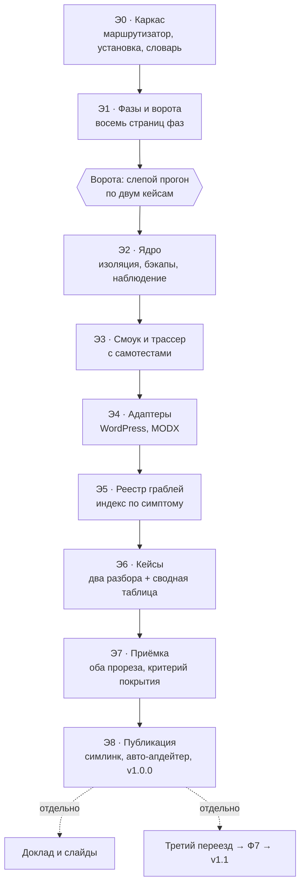

# Спека: скилл `shared-to-vps`

> Спека для агентов-исполнителей. Следующий шаг после утверждения — план реализации.
> Дата: 2026-09-23. Статус: на утверждении.
> Источники фактуры: спеки, runbook'и и инцидентные разборы двух переездов из приватных
> репозиториев проектов. Ссылки на них здесь не приводятся: репозиторий публичный, а задачи
> и контекст проекта ведутся в приватном трекере автора.

## Problem Statement

В сентябре 2026 два сайта переехали с общего хостинга на изолированный VPS с разницей
в сутки. Оба стояли на одном хостинг-аккаунте, оба пережили два заражения за неделю, оба
в итоге уехали, и оба переезда прошли по одной схеме. Второй занял заметно меньше времени
ровно потому, что от первого остались артефакты: смоук с самотестом, скрипты приёмки,
паттерн изоляции сетей, проверяемый бэкап-набор.

Проблема в том, где это знание сейчас лежит.

**Оно лежит двумя копиями в двух приватных репозиториях и в голове одного человека.**
Копии уже разошлись: у второго проекта появились применятор конфига прокси со сверкой инода
и трассер запретов живыми пробниками, у первого их нет, хотя нужны обоим. Грабли записаны в
трёх разных местах и в трёх разных форматах: часть в runbook'ах проектов, часть в отдельном
реестре памяти, часть в комментариях к тикетам. Третий переезд начнётся с поиска, в каком из
двух репозиториев версия скрипта свежее.

**Цена незнания здесь измерена, а не предположена.** Отказы в этой области молчаливые, и
именно они стоили времени:

- докрут приехал из архива хостинга с правами `0700`, и веб-сервер отдавал 403 на всё;
- после оборванного прогона восстановления каждый URL отвечал 200 и рендерил главную:
  каталог, услуги и контакты были байт-в-байт одной страницей, а по кодам ответа сайт
  выглядел исправным;
- медиа-источник с ведущим слэшем давал адреса вида `//assets/...`, браузер читал это как
  имя хоста, логотипы и миниатюры не грузились. Страница при этом 200, все проверки зелёные;
- запрет точечных файлов стоял в веб-сервере ниже общего правила для PHP, и пути вида
  `/.secret.php` исполнялись. Первая версия проверки этого запрета была зелёной при открытой
  дыре, потому что пробник не имел расширения `.php`;
- плагин формы в бесплатной редакции не хранит заявки вовсе. Письмо было единственным
  носителем обращения, и сбой почты терял заявку молча, показывая посетителю «успешно»;
- сайт шесть дней держался на статическом кэше, запечённом за минуту до отказа PHP: все
  страницы отдавали 200, а любой запрос мимо кэша отвечал 500.

Ни одна из этих поломок не ловится вопросом «сайт открывается?». Все ловятся конкретной
проверкой, про которую надо знать заранее.

**Гипотеза, которая делает задачу не разовой.** Общий хостинг продаёт статистическое
усреднение нагрузки, а вместе с ним, не объявляя этого в оферте, продаёт общую поверхность
атаки. Пока перебор стоил дорого, массово доставалось только крупным. Сейчас перебор
подешевел, и заражение уровня аккаунта из редкого события стало рядовым. Признак, по
которому оно отличается от взлома отдельного сайта, в обоих кейсах был один и тот же: файлы
приезжали в площадку без CMS вообще, то есть писал процесс, а не уязвимость приложения.
Значит такие истории будут повторяться, и повторяться у других людей тоже.

**Что именно теряется без скилла.** Не команды: команды находятся поиском. Теряется
последовательность и обязательность проверок. Оба кейса ломались не там, где не хватало
знаний, а там, где шаг пропускали: разворачивали до проверки чистоты снимка, принимали по
кодам ответа вместо тел страниц, писали конфиг в файл, который контейнер не читает.

## Solution

Один скилл-конвейер `shared-to-vps` в отдельном публичном обезличенном репозитории.

**Конвейер из восьми фаз с воротами между ними.** Ворота открываются доказательством, а не
утверждением: «стек поднялся» и «в логах нет ошибок» доказательством не считаются. Точка
входа определяется состоянием сайта, а не желанием исполнителя. Дальше маршрут общий и назад
не сворачивает.

**Ядро и адаптеры.** CMS-агностичное ядро отвечает за изоляцию, приёмку, бэкапы и наблюдение.
Тонкие адаптеры отвечают за конкретную CMS. Граница выведена из фактов двух переездов, а не
придумана: разбор путей в точке входа и парсер шаблонов принадлежат одной CMS, а порядок
правил в веб-сервере, отвязанный инод конфига и молчаливая потеря заявки оказались общими.

**Публичный репозиторий без единого реального адреса, домена, логина, хостера и подрядчика.**
Технические детали сохраняются полностью: они ценны и никого не выдают. Конкретика площадки
живёт профилем за пределами репозитория.

**Фаза разбора полётов как часть работы.** После приёмки скилл обязывает дописать новые
грабли, при необходимости новый адаптер и строку в журнале версий. Рост перестаёт зависеть от
доброй воли после успешного переключения, когда записывать уже никому не хочется.

### Карта работ

## User Stories

**Исполнитель переезда**

1. Как исполнитель, я хочу назвать состояние сайта и получить точку входа в конвейер, чтобы
   не решать заново, с чего начинать, когда сайт лежит и время дорого.
2. Как исполнитель, я хочу получить признак, по которому заражение уровня аккаунта отличается
   от взлома одного сайта, чтобы не тратить неделю на чистку, которая ничего не закрывает.
3. Как исполнитель, я хочу, чтобы скилл не дал развернуть снимок до доказательства его
   чистоты, чтобы не перенести заражение на новую площадку своими руками.
4. Как исполнитель, я хочу знать, какие части архива хостинга контентом сайта не являются,
   чтобы не тащить на новую площадку многогигабайтный лог ошибок и чужие деплой-хуки.
5. Как исполнитель, я хочу получить готовое ядро стека, чтобы не собирать изоляцию сетей,
   лимиты и запреты заново и не воспроизводить ошибку в порядке правил веб-сервера.
6. Как исполнитель, я хочу видеть реестр граблей с поиском по симптому, чтобы при «403 на
   всё» и «каждый URL рендерит главную» находить причину за минуту, а не за вечер.
7. Как исполнитель, я хочу, чтобы восстановление было идемпотентным скриптом, чтобы
   оборванный прогон перезапускался целиком, а не докручивался руками до странного состояния.
8. Как исполнитель, я хочу, чтобы конкретика моей площадки не лежала в публичном репо, чтобы
   публиковать инструмент, не публикуя инфраструктуру.
9. Как исполнитель, я хочу, чтобы скилл запрещал писать секреты в отчёты и в журналы, чтобы
   не повторить историю, когда пароли уехали в git через отчёт о самопроверке.
10. Как исполнитель, я хочу, чтобы скилл не дал переключить домен до зелёной приёмки, чтобы не
    переводить живых посетителей на сломанную копию.
11. Как исполнитель, я хочу иметь записанный откат до переключения, чтобы возврат был одной
    строкой, а не поиском прежнего адреса в истории переписки.
12. Как исполнитель, я хочу список того, что при переключении нельзя трогать ни при каких
    условиях, чтобы переезд сайта не уронил корпоративную почту и не стёр подтверждение
    владения в поисковой консоли.
13. Как исполнитель, я хочу проверять делегирование зоны авторитетно, а не по панели, чтобы не
    править записи, которые ни на что не влияют.
14. Как исполнитель, я хочу получить отчёт о пройденных проверках в готовом виде, чтобы
    отчитаться заказчику фактами, а не ощущением.
15. Как исполнитель, я хочу знать, когда можно выключать старую площадку, чтобы не платить за
    неё год и не снести её на второй день.

**Агент-исполнитель**

16. Как агент, я хочу читать только ту фазу, в которой работаю, чтобы не тратить контекст на
    семь остальных.
17. Как агент, я хочу видеть у каждой фазы явный критерий выхода, чтобы понимать, закончил я
    её или нет, без вопроса к человеку.
18. Как агент, я хочу знать, какие проверки бесполезны и почему, чтобы не считать зелёный
    результат доказательством там, где он ничего не доказывает.
19. Как агент, я хочу знать, какие правки конфигов не доезжают до контейнера, чтобы не
    объявлять успех по файлу, которого рабочий процесс не видит.
20. Как агент, я хочу после приёмки получить прямое указание дописать грабли и версию, чтобы
    знание не осталось в логе сессии.
21. Как агент, я хочу знать, что обязан проверить глазами, а не только кодом ответа, чтобы не
    сдать сайт без картинок как принятый.

**Владелец сайта и его менеджеры**

22. Как владелец, я хочу, чтобы сайт открывался и принимал заявки, чтобы не терять обращения
    в сезон.
23. Как владелец, я хочу, чтобы старая площадка оставалась живой до приёмки новой, чтобы
    существовал путь назад.
24. Как владелец, я хочу, чтобы почта домена и подтверждение владения в поиске не пострадали
    при переключении, чтобы переезд сайта не уронил ящики.
25. Как владелец, я хочу, чтобы позиции в поиске не просели из-за переезда, чтобы не потерять
    трафик, за который уже заплачено.
26. Как менеджер, я хочу получать письма с заявок как раньше, чтобы узнавать об обращении не
    от клиента по телефону.
27. Как владелец, я хочу знать стоимость новой площадки и её отличие от прежней, чтобы решать
    осознанно, остаёмся мы здесь или это временная мера.
28. Как владелец второго проекта на том же сервере, я хочу быть уверен, что новый сосед не
    уронит мой, чтобы не платить за чужой всплеск нагрузки простоем.

**Читатель со стороны и сопровождающий**

29. Как читатель, я хочу прочитать два разбора с конкретными числами и ошибками, чтобы
    поверить методике или обоснованно с ней не согласиться.
30. Как читатель, я хочу взять репозиторий и применить его у себя, не имея отношения к
    исходным проектам, чтобы польза не зависела от знакомства с автором.
31. Как читатель, я хочу сразу видеть границы применимости, чтобы не пытаться натянуть метод
    на управляемую платформу, где он не работает.
32. Как сопровождающий, я хочу, чтобы новая CMS добавлялась адаптером и не трогала ядро, чтобы
    третий переезд не превращался в переписывание всего.
33. Как сопровождающий, я хочу видеть в журнале версий, какой переезд дал какие изменения,
    чтобы понимать, метод устоялся или пока описывает частные случаи.
34. Как докладчик, я хочу иметь под рукой обезличенную фактуру с числами, чтобы отвечать на
    вопросы из зала конкретикой, а не общими словами.

## Implementation Decisions

**Словарь проекта.** Термины фиксируются один раз и используются во всех артефактах без
синонимов: **конвейер** (последовательность фаз), **фаза** (участок работ со своим критерием
выхода), **ворота** (доказательство, без которого переход к следующей фазе запрещён),
**прорез** (точка, в которой проверяется внешнее поведение), **снимок** (архив файлов и дампа,
из которого переносится сайт), **точка отката** (прежняя живая площадка), **переключение**
(перевод домена на новую площадку), **докрут** (корень сайта), **ядро** (CMS-агностичная
часть), **адаптер** (часть, принадлежащая одной CMS), **профиль площадки** (конкретика вне
репозитория). Словарь может позже переехать в отдельный доменный документ репозитория, но
единственность терминов обязательна с первого коммита: в двух исходных проектах одно и то же
называлось то швом, то прорезом, то проверкой, и это уже мешало искать.

**Состав компонентов и их ответственность.** Файловых путей спека не фиксирует сознательно,
только компоненты и их обязанности.

- **Маршрутизатор** — единственная точка входа. Определяет состояние сайта, выдаёт фазу,
  перечисляет правила, действующие всегда, и ссылается на остальное. Держится коротким,
  ориентир до 150 строк: он читается целиком каждый раз.
- **Страницы фаз** — по одной на фазу, читаются по одной за раз. Нумерация с шагом десять,
  чтобы вставлять фазу между существующими без переименования остальных.
- **Реестр граблей** — отдельный компонент, индексируется по симптому, а не по причине. Ищут
  его в момент, когда виден симптом, и причина как раз неизвестна.
- **Ядро** — исполняемые артефакты, не зависящие от CMS: описание стека с изоляцией сетей и
  лимитами, конфигурация веб-сервера с запретами, применятор конфига обратного прокси,
  проверяемые бэкапы с расписанием, внешняя шифрованная копия, смоук с самотестом, трассер
  запретов, сторож целостности.
- **Адаптеры** — по одному на CMS, содержат только то, что действительно своё: разворачивание
  снимка, генерацию конфигурации, правку путей в сериализованных значениях, эталоны для
  внутренней приёмки и специфические грабли.
- **Разборы кейсов** — два обезличенных описания и сводная таблица «общее против своего»,
  которая служит доказательством, что деление на ядро и адаптер не выдумано.
- **Журнал версий** и **README для человека** с явными границами применимости.

**Восемь фаз и их ворота.**

- **Ф0 Триаж.** Решается один вопрос: заражение на уровне аккаунта или на уровне приложения.
  Признак различения — писал ли процесс в площадки, не имеющие отношения к уязвимости. Если
  уровень аккаунта, чистка бессмысленна по определению, и скилл говорит это прямо. *Ворота:*
  зафиксирован прежний адрес для отката, снижено время жизни записей, назван источник снимка.
- **Ф1 Снимок и чистота.** Чистота доказывается сверкой ядра CMS с внешним манифестом или
  дифом двух снимков по датам. Сигнатурный скан применяется как дополнение, а не как
  доказательство: он даёт ложные срабатывания пачками и не даёт отрицательного результата.
  *Ворота:* контрольная сумма снимка зафиксирована, чистота доказана названным методом.
- **Ф2 Стек.** Изоляция как архитектура: ни одного опубликованного порта, база только во
  внутренней сети без маршрута наружу, исходящая сеть отдельно и только приложению, лимиты
  памяти и процессора заданы явно. Имена сервисов с префиксом проекта: система контейнеров
  добавляет имя сервиса псевдонимом в каждую сеть, и два одноимённых сервиса в общей сети
  дают неопределённое разрешение имени. *Ворота:* трассер живыми пробниками, не чтением
  конфига.
- **Ф3 Разворачивание.** Идемпотентный скрипт вместо последовательности команд в чате.
  Оборванный прогон перезапускается целиком. Правки приезжают в контейнер так, чтобы инод не
  подменялся, и сверяются внутри и снаружи: отвязанный бинд делает зелёными и проверку
  синтаксиса, и перезагрузку конфига, которого рабочий процесс не видит. *Ворота:* два прогона
  подряд дают одинаковый результат.
- **Ф4 Приёмка.** Снаружи — чёрным ящиком по настоящему имени хоста, со сравнением тел
  страниц, а не только кодов. Изнутри — то, что снаружи принципиально не видно: счётчики
  ключевых таблиц против эталона, проверка целостности таблиц, владелец и режимы докрута,
  отсутствие исполняемого кода там, где его быть не должно. Плюс скан безопасности по живому
  и отдельное доказательство, что заявка дошла до человека. *Ворота к Ф5:* всё перечисленное
  зелёное и письмо найдено во входящих.
- **Ф5 Переключение.** Откат записан строкой заранее. Почтовые записи, политика отправителей
  и подтверждение владения в поиске не трогаются ни при каких условиях. Делегирование зоны
  проверяется авторитетно у реестра, а не в панели: правки в панели не значат ничего, пока
  реестр указывает на чужие серверы имён. Сертификат выпускается после переключения, вариант
  с `www` отдаёт постоянный редирект на основной адрес. Старая площадка остаётся живой как
  точка отката, с назначенной датой выключения. *Ворота:* новое имя отвечает с новой площадки,
  откат проверен на бумаге, неприкосновенные записи на месте.
- **Ф6 Эксплуатация.** Бэкап считается бэкапом только после реальной распаковки и импорта во
  временную базу, до публикации набора. Внешняя копия шифруется. Эталон для сторожа снимается
  после приёмки, иначе каждый перенесённый файл придёт находкой. Доступ агента и человека к
  файлам идёт через контейнеры, не через FTP. *Ворота:* один полный цикл бэкапа и один прогон
  сторожа прошли на живой площадке.
- **Ф7 Разбор полётов.** Новые грабли в реестр, новый адаптер при новой CMS, строка в журнал
  версий, обезличивание перед коммитом. *Ворота:* версия поднята, изменения описаны.

**Сквозная доктрина, действует во всех фазах.** Отказы здесь молчаливые, поэтому зелёная
проверка без взгляда глазами приёмкой не считается, а любая проверка обязана иметь
доказанный отрицательный результат: если она никогда не падала, она ничего не гарантирует.

**Два репозитория с направленной публикацией.** Рабочий репозиторий приватный: в нём спеки,
планы, договорённости с агентом, логи сессий и сырые разборы с реальными именами. Публичный
репозиторий это **сборочный вывод**: он собирается заново из аллоулиста при каждой публикации,
и всё, чего в аллоулисте нет, из него исчезает.

Направление отказа выбрано осознанно. Список запрещённого («публично всё, кроме
перечисленного») ошибается в сторону утечки: забыл дописать исключение — файл уехал наружу
навсегда. Аллоулист ошибается в сторону недодачи: забыл дописать строку — читатель не увидел
полезного файла, и лечится это одной строкой. Цена ошибки падает с необратимой до досадной.

Публикация проходит три ворот: рабочее дерево источника зафиксировано (иначе в публичной
истории появится состояние, которого нет ни в одном приватном коммите), список запрещённых
строк существует (его отсутствие это не «нечего проверять», а «проверка не выполнена»), и
собранное дерево этих строк не содержит. Проверяется именно собранное дерево, а не приватный
репозиторий целиком: в приватном такие строки лежат законно.

Публичная история ссылается на приватную только хэшем коммита. Ни имя приватного
репозитория, ни номера внутренних задач наружу не уезжают: для читателя со стороны это битые
ссылки, а для нас лишнее указание на приватный трекер.

**Размещение и установка.** Симлинк в каталог скиллов пользователя ведёт на **рабочий**
репозиторий: скилл используется из него, а публичный нужен только читателям. Имя скилла в нижнем регистре через дефис: регистр и пробелы в имени недопустимы.
Имя репозитория тоже в нижнем регистре, иначе клон на файловую систему, чувствительную к
регистру, ловит грабли на ровном месте. Блок отслеживания дописывается в реестр авто-апдейтера
окружения, если тот установлен.

**Отношение к существующим репозиториям проектов.** Они остаются источником фактуры, а не
зависимостью. Код переносится копированием с обезличиванием. Симлинков и вложенных
репозиториев между публичным скиллом и приватными проектами не будет: иначе публичный репо
перестанет быть самодостаточным, а приватный получит внешнего потребителя своих внутренних
путей.

**Профиль площадки.** Конкретика живёт в каталоге настроек пользователя, вне репозитория:
адрес сервера, псевдоним доступа, имя стека и путь к нему, домен, источник снимка, прежний
адрес для отката, срок жизни старой площадки, список запрещённых к публикации строк. Секреты
в профиль не пишутся вообще: пароли базы и почты живут в файле окружения с правами 600 на
самом сервере. Профиля нет — скилл создаёт его со слов исполнителя и показывает, что записал.

**Обезличивание.** Заменяются домены, адреса серверов, имена аккаунтов, хостеров, стеков,
людей и подрядчиков, ящики и счётчики аналитики. Сохраняются режимы прав, размеры и имена
паразитных файлов, номера портов, названия директив, тексты ошибок, последовательности
проверок и числа, объясняющие решение. Кейсы идут как «Сайт A» и «Сайт B» с указанием CMS и
типа сайта.

**Версионирование.** Мажорная версия меняется при изменении состава фаз или ворот, минорная
при новом адаптере или новой фазе, патч при граблях и правках текста. Запись в журнале версий
называет переезд, который дал изменения: какая CMS, сколько новых граблей, что пришлось
поправить в ядре.

**Трекер задач для этого проекта.** Задачи и спеки живут в общем приватном репозитории памяти
под собственной проектной меткой, как у остальных проектов. Конфигурация трекера в публичный
репозиторий не попадает: она называет приватный репозиторий и внутренние метки, то есть
относится к инфраструктуре, а не к методу. Регистрация проекта делается в реестре проектов
скилла памяти.

**Отношение к системе памяти.** Скилл работает без неё. Если она доступна, фаза разбора
полётов дополнительно предлагает записать проектный контекст туда. Реестр граблей самого
скилла остаётся источником истины для метода, память — для конкретного проекта.

## Testing Decisions

Хорошая проверка здесь отвечает на вопрос «поймает ли этот скилл то, что уже случалось».
Проверять надо внешнее поведение, а не устройство: «структура соответствует спеке» и «файлы
на месте» не тесты, а следствия.

**Прорез 1, главный и самый высокий: слепой прогон агента по сценарию.** Субагент с чистым
контекстом получает только скилл и описание состояния из кейса. Он должен сам назвать точку
входа, порядок фаз, критерии выхода и те проверки, которые в этом кейсе были решающими. Если
он предлагает разворачивать до проверки чистоты снимка, принимать по кодам ответа или
переключать домен до зелёной приёмки, скилл недоделан. Прогон делается по двум кейсам с
разным состоянием на входе: сайт лежит с ошибкой приложения и сайт формально жив на кэше при
отказавшем PHP. Это прорез именно потому, что меряет поведение системы целиком, включая
способность скилла не дать пропустить шаг.

**Прогон ставится воротами после этапа фаз, а не в конце работы.** Если конвейер на голых
фазах не заставляет агента проверить чистоту снимка, дописывать поверх этого шаблоны и
адаптеры бессмысленно. На финальной приёмке прогон повторяется как регрессия.

**Прорез 2: ядро на локальном стенде.** Шаблоны это исполняемый код, а не проза, и им нужен
свой прорез ниже первого. Ядро поднимается на локальном докере с пустышкой вместо сайта.
Проверяется: ни один порт не опубликован, база недостижима снаружи внутренней сети, запреты
срабатывают по живым пробникам с расширением `.php` (запрет на чтение файла работает там, где
запрет на исполнение нет, и первая версия проверки попалась именно на этом), бэкап-набор
создаётся и проходит обе внутренние проверки, смоук и трассер проходят собственные самотесты
против подставного сайта. Боевой сервер для этого не нужен.

**Прецеденты (prior art).** Оба прореза уже существуют в исходных проектах и переносятся, а не
изобретаются: смоук с самотестом против подставного сайта и трассер запретов живыми
пробниками обкатаны на втором переезде. Новое здесь только слепой прогон агента, и он
строится из готовой фактуры двух кейсов.

**Критерий покрытия, не прорез: матрица прослеживаемости.** Каждая грабля из двух кейсов
обязана указывать на фазу и ворота, которые бы её поймали. Грабля без ворот означает дырку в
конвейере: либо появляется проверка, либо явная запись «этого конвейер не ловит, вот почему».
Матрица ничего не исполняет и поведение не меряет, поэтому тестом не называется, но релиз без
неё не выпускается.

**Проверка обезличивания** входит в приёмку отдельным шагом: поиск по списку запрещённых строк
по всему дереву и по истории до первого публичного пуша.

Приёмка скилла пройдена, когда оба прореза зелёные, матрица полна и проверка обезличивания
чистая.

## Out of Scope

- **Доклад, слайды и тезисы.** В репозитории лежат только обезличенные разборы кейсов как
  фактура. Формат и регламент выступления пока неизвестны, канва делается отдельно.
- **Миграции между общими хостингами.** Исключены названием сознательно. В обоих кейсах этот
  вариант рассматривался и был отвергнут, во втором отдельным закрытым тикетом, потому что
  разваливался слой PHP самого провайдера.
- **Управляемые платформы, оркестраторы и облачные рантаймы.** Ядро предполагает root,
  контейнеры и обратный прокси перед стеком. Границы применимости пишутся честно.
- **Методика расследования инцидента и переписка с хостером.** Скилл использует вывод «уровень
  аккаунта или уровень приложения», но не учит форензике и не заменяет юридическую часть.
- **Рефакторинг существующих репозиториев проектов.** Их скрипты остаются на месте. Обратный
  перенос улучшений из скилла в проекты — отдельное решение, не условие этой работы.
- **Упаковка в плагин и маркетплейс.** Структура выбирается так, чтобы это стало возможным без
  переделки, но сейчас не делается.
- **Перевод сайта на другой стек приложения** (например с CMS на генератор статики). Другая
  задача со своей картой.
- **Автоматическое обнаружение заражения и мониторинг как продукт.** Сторож целостности входит
  в конвейер как шаг эксплуатации, но система оповещения со своим интерфейсом не строится.

## Further Notes

- **Почему `VPS` в названии, а не «хостинг».** Имя обязано исключать неверный сценарий, а не
  только описывать верный. «Миграция хостинга» допускает переезд на соседний общий аккаунт,
  то есть ровно то, что в обоих кейсах пришлось отменять.
- **Признанное ограничение: ядро описывает один конкретный способ изоляции.** Контейнеры,
  обратный прокси, системный планировщик. Это не единственный способ и не лучший для всех. Он
  выбран потому, что дважды проверен под нагрузкой реальных сайтов и укладывается в ресурсы
  недорогого сервера. README говорит это прямо, чтобы читатель не принял ограничение за
  утверждение об универсальности.
- **Почему кейсы обезличены, но детальны.** Убедительность держится на конкретных числах и
  конкретных ошибках. Разбор, из которого вычистили цифры, перестаёт быть доказательством и
  становится рекламой метода.
- **Риск объёма.** Восемь фаз это много для одного скилла. Защита — чтение по одной фазе. Если
  на практике окажется, что фазы читают вразнобой и контекст всё равно раздувается, честный
  выход — вынести эксплуатацию и разбор полётов отдельными скиллами, оставив в конвейере
  ссылки. Это мажорное изменение, и оно допустимо.
- **Что подтвердит пользу.** Третий переезд, пройденный по скиллу, с записанной строкой о том,
  сколько новых граблей он дал. Ноль новых будет означать, что метод устоялся, большое число —
  что конвейер пока описывает два кейса, а не класс задач.
